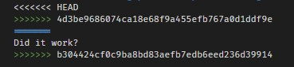

# messmeup
a repo for awful mistakes

<<<<<<< HEAD
Meh'rab's first idea was to order our names in a git document so I made a document for that called Names.txt
=======
# OMG I'm kind of hungry. Does anyone have a good recipe for chocolate chip cookies?
<<<<<<< HEAD
>>>>>>> 4d3be9686074ca18e68f9a455efb767a0d1ddf9e
=======
Did it work?
>>>>>>> b304424cf0c9ba8bd83aefb7edb6eed236d39914

## note

those above are called conflict markers, added by git to the working directory when there's a merge conflict, meant as an aid to resolving the conflict before committing. if you ever to to actually stage and commit text like that, git won't stop you, but it's never the right thing to do. it's like getting an exception in your code and then sending the stack trace to the user and inserting it into your database, instead of catching it and handling it.

although, running into this the first day with git is a good sign of trying things out without being too scared of doing it wrong 👍

## couple things to try
1. make a commit but leave a typo in the commit message. then figure out how to replace the commit with a corrected commit message with just one command (i.e. not by using `git reset` first). consider why this wouldn't normally be a good idea if you'd already pushed the typoed commit to the remote repository.
2. look inside the `.git` folder and see if any of the files there are text files you can understand. you can always use git commands to interface with these files and you never actually need to go in there manually, though.
3. perform a merge, ideally a non-fast-forward one so there are changes on both sides, and then figure out how to tell `git diff` to tell you about each set of changes - from the point of view of one and also the other parent commit of the merge commit.
